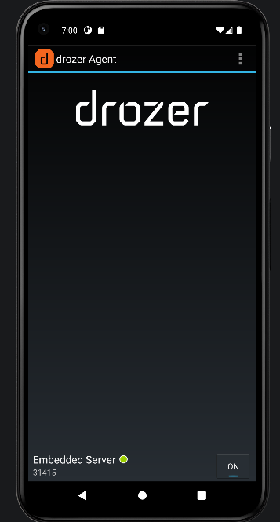
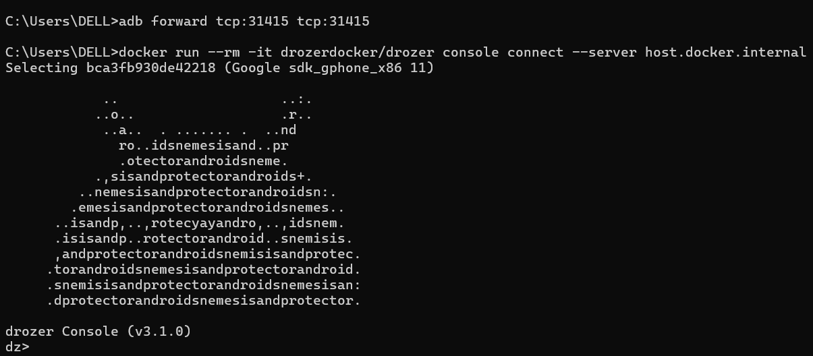
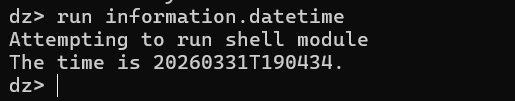
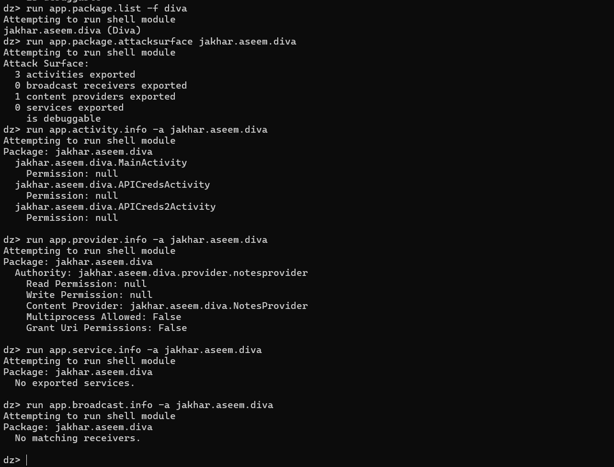
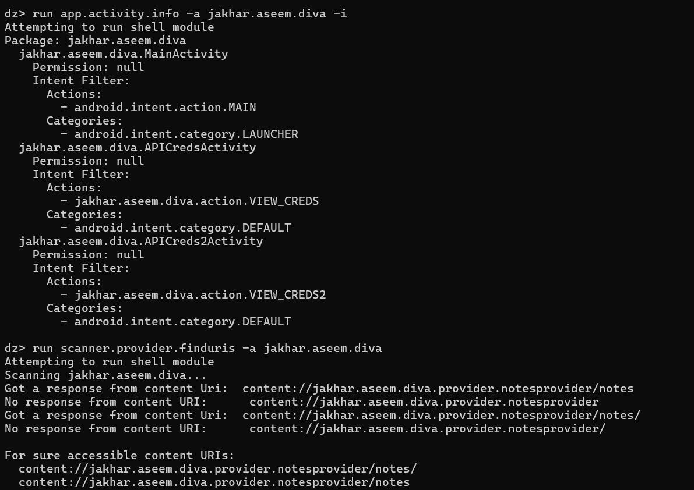
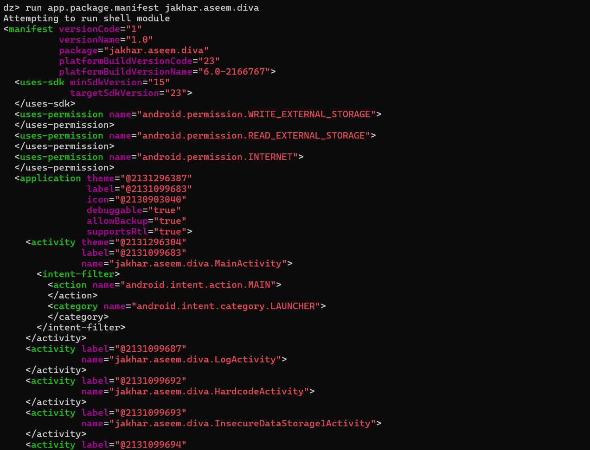

# Rapport d'Audit de Sécurité Android - Lab9 (DIVA)

Ce document retrace les étapes de l'audit de sécurité effectué sur l'application **jakhar.aseem.diva** via le framework **Drozer** au sein du projet **Lab9**.

---

##  Étape 1 & 2 : Connexion et Validation du Canal

L'environnement utilise Docker pour la console Drozer et un émulateur Android Studio (API 30) pour l'agent.

1.  **Lancement de l'Agent** : Serveur embarqué activé sur le port 31415.
    

2.  **Établissement du Pont (ADB Forward)** :
    ```powershell
    adb forward tcp:31415 tcp:31415
    ```

3.  **Connexion de la Console via Docker** :
    ```powershell
    docker run --rm -it drozerdocker/drozer console connect --server host.docker.internal
    ```
    

**Validation du canal :** La commande `run information.datetime` confirme la communication active.


---

##  Étape 3 : Cartographie des composants exposés

L'analyse de la surface d'attaque de l'application `jakhar.aseem.diva` a révélé des composants critiques exportés sans protection.

**Résumé de la surface d'attaque :**
* **3 activities** exportées (Accès aux écrans).
* **1 content provider** exporté (Accès aux données).
* **is debuggable** : True (Faille majeure).



### Tableau récapitulatif des composants exposés

| Type de composant | Nom du Composant | Exporté | Protection |
| :--- | :--- | :--- | :--- |
| **Activity** | `jakhar.aseem.diva.MainActivity` | Oui | Aucune (`null`) |
| **Activity** | `jakhar.aseem.diva.APICredsActivity` | Oui | Aucune (`null`) |
| **Activity** | `jakhar.aseem.diva.APICreds2Activity` | Oui | Aucune (`null`) |
| **Provider** | `jakhar.aseem.diva.provider.notesprovider` | Oui | Aucune (Read/Write: `null`) |

---

##  Étape 4 : Vérification des protections

L'examen du manifeste et des URI montre des failles critiques.

1.  **Analyse du Manifeste** : Flags `debuggable="true"` et `allowBackup="true"` détectés.
2.  **Intent Filters** : Actions personnalisées (`VIEW_CREDS`) accessibles sans permission.
    
3.  **Permissions du Provider** : Le `NotesProvider` n'impose aucune restriction de lecture.
    

---

##  Étape 5 : Analyse des risques

| Composant | Risque Identifié | Scénario d'abus potentiel |
| :--- | :--- | :--- |
| **Activities** | Auth Bypass | Lancement direct de `APICredsActivity` pour voler des credentials. |
| **Providers** | Information Disclosure | Lecture complète de la base de données `/notes` via Drozer. |
| **Manifeste** | Local Data Leakage | Extraction des données via `adb backup` sans être root. |

---

##  Étape 6 & Triage : Priorisation des vulnérabilités

| ID | Composant | Vulnérabilité | Sévérité | Impact | Statut |
| :--- | :--- | :--- | :--- | :--- | :--- |
| **V1** | `NotesProvider` | URIs accessibles sans permission | **Critique** | Fuite de données utilisateur | À corriger |
| **V2** | `APICredsActivity` | Activité exportée sans protection | **Élevée** | Accès à des données sensibles | À corriger |
| **V3** | `Manifeste` | Mode Debug activé | **Élevée** | Reverse Engineering facilité | À corriger |

---

##  Mapping OWASP (MASVS/MASTG)

| ID | Vulnérabilité | Référence MASTG | Description du Standard |
| :--- | :--- | :--- | :--- |
| **V1** | Activités exportées | **MSTG-PLATFORM-1** | Exposition de composants internes. |
| **V2** | Provider mal protégé | **MSTG-STORAGE-2** | Données sensibles stockées sans protection. |
| **V3** | Debugging activé | **MSTG-RESILIENCE-1** | Manque de protection en production. |

---
*Rapport généré dans le cadre du Lab9 - Audit de sécurité Android.*
